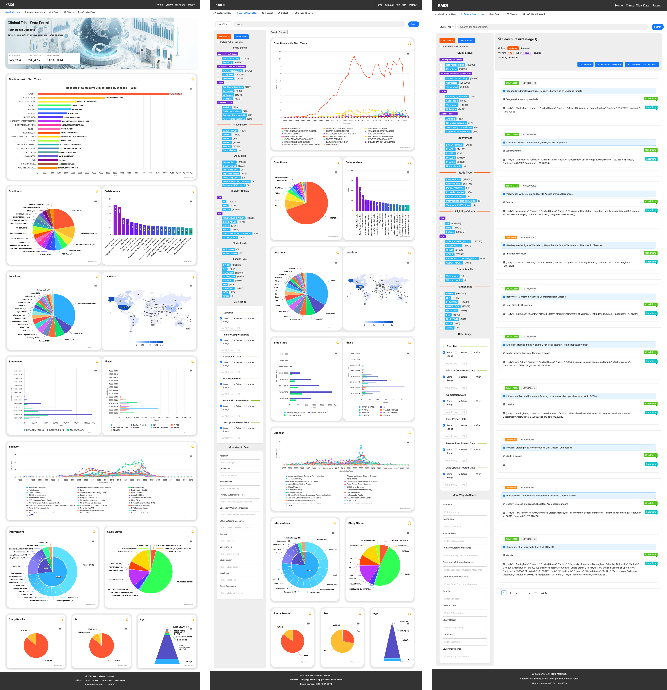
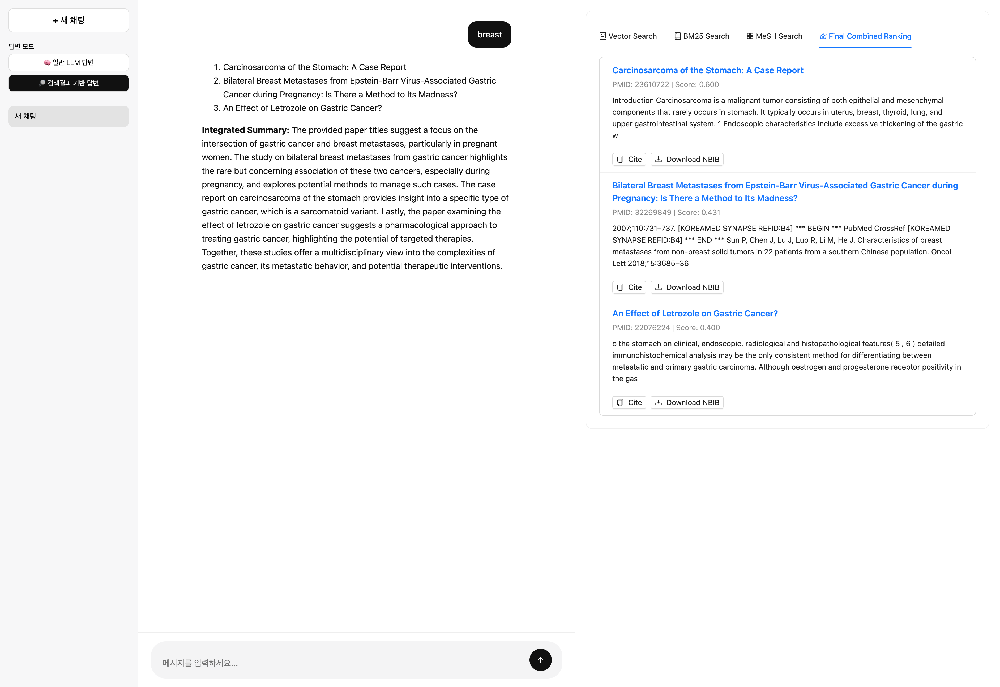

# Taehoon Jang  

Full-Stack Engineer · AI Systems · Secure Data Platforms  
Biomedical Informatics Lab, Seoul National University · since 2010 (present)  
Software Engineering since 2000  

---

## Engineering & Research Areas

- Healthcare Data Platforms  
- Medical AI Systems  
- Privacy-Preserving Data Analysis  
- Blockchain & Trust Infrastructure  
- Secure Computing Environments 

---

## Selected Projects

The following five projects represent key systems and platforms developed through my work in healthcare data platforms, 
AI systems, and secure computing environments.In most of these projects, I led the system design and core implementation.

---

# 🧠 KryptoBrain

Secure Analysis Platform for Privacy-Preserving Data Processing

---

## 📌 Overview

KryptoBrain은 개인정보 또는 의료데이터와 같은 민감 데이터를 안전하게 분석하기 위한 **Secure Analysis Platform**이다.  
데이터를 중앙으로 수집하는 방식이 아니라 **분석 실행 환경을 안전하게 생성하고 관리하는 방식**으로 설계되었다.  
분석 대상 데이터는 **CDM 기반 의료 데이터, 개인 건강 데이터(PHR), Chrome Extension을 통해 수집되는 사용자 로그 및 Life Log 데이터** 등을 실제로 연동하여 분석 환경에서 처리할 수 있도록 구현하고 테스트하였다.  
분석은 **Kubernetes** 기반 **Analysis Pod**에서 실행되며 데이터는 외부 환경으로 직접 전달되지 않는다.  
데이터 제공자는 원본 데이터를 공유하지 않고 분석 결과만 전달할 수 있으며 분석 실행 과정과 결과는 검증 가능한 형태로 관리된다.  
또한 연구의 생성, 참여, 결과 기록은 **Blockchain 기반 Smart Contract**와 **DAO 거버넌스**를 통해 관리되어 분석 과정과 결과의 무결성과 투명성을 확보한다.

---

## 🎬 KryptoBrain Demo Video

*System concept, architecture, and demo video produced by Taehoon Jang.*

# 🪪 RhymeCard

Decentralized Identity Platform for Digital Identity & Community Membership

---

## 📌 Overview

RhymeCard는 블록체인 기반 **Decentralized Identity Platform**으로, 개인의 신원 인증과 커뮤니티 멤버십 관리를 안전하게 수행하기 위한 **디지털 신분증 서비스**이다.
기존 중앙 서버 기반 계정 시스템과 달리 사용자의 신원은 **DID(Decentralized Identifier)** 기반으로 관리되며 개인이 자신의 신원 정보와 인증 데이터를 직접 통제할 수 있도록 설계되었다.  
또한 사용자의 신원 및 자격 정보는 **Verifiable Credential (VC)** 형태로 발급되며 필요 시 **Verifiable Presentation (VP)** 방식으로 선택적으로 증명할 수 있어 개인정보를 직접 공개하지 않고도 신뢰 가능한 인증을 수행할 수 있다. 
RhymeCard는 **모바일 앱** 형태로 발급되며 사용자는 **QR 코드 또는 NFC 방식**으로 간편하게 신원 인증과 멤버십 확인을 수행할 수 있다. 이 시스템은 병원, 커뮤니티, 행사 등 다양한 환경에서 **개인 인증, 회원 관리, 서비스 접근 제어**를 지원한다.  

---

## 🎬 RhymeCard

# 🏥 Health Avatar Project

Personal Healthcare Data Platform for Integrated Medical Data Management

---

## 📌 Overview

Health Avatar Project는 개인의 의료 데이터를 통합 관리하고 활용하기 위한 **Personal Healthcare Data Platform**이다.  
병원 **EMR(Electronic Medical Record)** 시스템과 개인의 **PHR(Personal Health Record)** 데이터를 연결하여 환자 중심의 의료 데이터 관리 환경을 제공하도록 설계되었다.  
플랫폼은 의료기관 시스템, 연구 플랫폼, 환자용 모바일 서비스 등 다양한 의료 애플리케이션이 상호 연동될 수 있도록 구성되어 있다.  
의료진은 **XNet, DialysisNet, RehabilitationNet**과 같은 전문 의료 애플리케이션을 통해 환자 데이터를 관리할 수 있으며 환자는 **Beans 모바일 앱**을 통해 자신의 건강 정보를 확인하고 관리할 수 있다.  
또한 플랫폼은 **PGxCDS, DOPPS, CKD 연구 관리 시스템**과 연계되어 임상 연구와 의료 데이터 분석을 위한 기반 인프라로 활용될 수 있다.

---

## 🎬 Health Avatar 

# 📊 Clinical Trial Search System

Clinical Research Data Exploration Platform based on ClinicalTrials.gov

---

## 📌 Overview

Clinical Trial Search System은 **ClinicalTrials.gov** 기반 대규모 임상시험 데이터를 수집·정규화하여 검색, 필터링, 통계 분석, 시각화를 제공하는 **Clinical Research Data Exploration Platform**이다.  
수십만 건 규모의 **JSON 임상시험 데이터를 ETL 파이프라인으로 처리**하여 데이터베이스에 저장하고 연구자가 실제로 사용하는 조건 중심으로 검색 구조를 설계하였다.  
사용자는 질환, 임상 단계, 국가, 연구 상태, 개입 방식 등의 다양한 조건을 기반으로 임상시험 데이터를 탐색할 수 있다.  
또한 데이터는 **MySQL 기반 구조화 데이터베이스와 Elasticsearch 검색 인덱스**를 통해 관리되어 대규모 임상 데이터에 대한 효율적인 검색과 분석을 지원한다.  
플랫폼은 **REST API 기반 데이터 서비스와 통계 View 구조**를 통해 연구 데이터 탐색, 분석, 시각화를 위한 기반 인프라로 활용된다.

---

## 🎬 Clinical Trial Search 

# 🔎 JGC Search System

Context-Aware Academic Paper Search based on Semantic Analysis

---

## 📌 Overview

JGC Search System은 학술 논문의 메타데이터와 전문(full-text)을 기반으로 의미 중심 검색을 제공하는 **Academic Paper Search Platform**이다.  
단순 키워드 검색이 아니라 논문 문장 단위의 의미를 분석하여 연구 주제와 관련된 논문을 탐색할 수 있도록 설계되었다.  
논문 데이터는 **PubMed 및 학술 데이터 소스**에서 수집되며 텍스트 파싱과 데이터 정규화를 통해 검색 가능한 구조로 변환된다.  
또한 **SBERT 기반 임베딩과 Vector Search 구조**를 활용하여 의미적으로 유사한 논문을 탐색할 수 있으며 검색 결과에서는 논문 전체가 아닌 **관련 근거 문장(Evidence Snippet)**을 함께 제공한다.  
최근에는 **Local LLM 기반 질의 응답 기능을 통합하여 논문 검색 결과를 요약하고 연구 질문에 대한 컨텍스트 기반 응답을 제공하도록 확장하였다.**

---

## 🎬 JGC Search 

