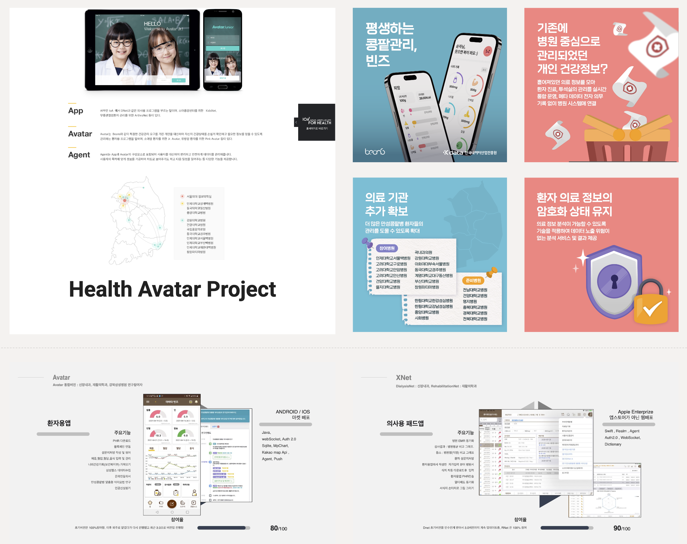

# Taehoon Jang  

Full-Stack Engineer · AI Systems · Secure Data Platforms  
Biomedical Informatics Lab, Seoul National University · since 2010  
Software Engineering since 2000  

---

## Engineering & Research Areas

- Healthcare Data Platforms  
- Medical AI Systems  
- Privacy-Preserving Data Analysis  
- Blockchain & Trust Infrastructure  
- Secure Computing Environments 

---

# 🧠 KryptoBrain

Secure Analysis Platform for Privacy-Preserving Data Processing

---

## 📌 Overview

KryptoBrain은 개인정보 또는 의료데이터와 같은 민감 데이터를 안전하게 분석하기 위한 **Secure Analysis Platform**이다.  
데이터를 중앙으로 수집하는 방식이 아니라 **분석 실행 환경을 안전하게 생성하고 관리하는 방식**으로 설계되었다.  
분석은 **Kubernetes** 기반 **Analysis Pod**에서 실행되며 데이터는 외부 환경으로 직접 전달되지 않는다.  
데이터 제공자는 원본 데이터를 공유하지 않고 분석 결과만 전달할 수 있으며 분석 실행 과정과 결과는 검증 가능한 형태로 관리된다.  
또한 연구의 생성, 참여, 결과 기록은 **Blockchain 기반 Smart Contract**와 **DAO 거버넌스**를 통해 관리되어 분석 과정과 결과의 무결성과 투명성을 확보한다.

---

## 🎬 KryptoBrain Demo

*System concept, architecture, and demo video produced by Taehoon Jang.*

# 🪪 RhymeCard

Decentralized Identity Platform for Digital Identity & Community Membership

---

## 📌 Overview

RhymeCard는 블록체인 기반 **Decentralized Identity Platform**으로, 개인의 신원 인증과 커뮤니티 멤버십 관리를 안전하게 수행하기 위한 **디지털 신분증 서비스**이다.
기존 중앙 서버 기반 계정 시스템과 달리 사용자의 신원은 **DID(Decentralized Identifier)** 기반으로 관리되며 개인이 자신의 신원 정보와 인증 데이터를 직접 통제할 수 있도록 설계되었다.  
또한 사용자의 신원 및 자격 정보는 **Verifiable Credential (VC)** 형태로 발급되며 필요 시 **Verifiable Presentation (VP)** 방식으로 선택적으로 증명할 수 있어 개인정보를 직접 공개하지 않고도 신뢰 가능한 인증을 수행할 수 있다. 
RhymeCard는 **모바일 앱** 형태로 발급되며 사용자는 **QR 코드 또는 NFC 방식**으로 간편하게 신원 인증과 멤버십 확인을 수행할 수 있다. 이 시스템은 병원, 커뮤니티, 행사 등 다양한 환경에서 **개인 인증, 회원 관리, 서비스 접근 제어**를 지원한다.  

---

## 🎬 RhymeCard

# 🏥 Health Avatar Project

Personal Healthcare Data Platform for Integrated Medical Data Management

---

## 📌 Overview

Health Avatar Project는 개인의 의료 데이터를 통합 관리하고 활용하기 위한 **Personal Healthcare Data Platform**이다.  
병원 **EMR(Electronic Medical Record)** 시스템과 개인의 **PHR(Personal Health Record)** 데이터를 연결하여 환자 중심의 의료 데이터 관리 환경을 제공하도록 설계되었다.  
플랫폼은 의료기관 시스템, 연구 플랫폼, 환자용 모바일 서비스 등 다양한 의료 애플리케이션이 상호 연동될 수 있도록 구성되어 있다.  
의료진은 **XNet, DialysisNet, RehabilitationNet**과 같은 전문 의료 애플리케이션을 통해 환자 데이터를 관리할 수 있으며 환자는 **Beans 모바일 앱**을 통해 자신의 건강 정보를 확인하고 관리할 수 있다.  
또한 플랫폼은 **PGxCDS, DOPPS, CKD 연구 관리 시스템**과 연계되어 임상 연구와 의료 데이터 분석을 위한 기반 인프라로 활용될 수 있다.

---

## 🎬 Health Avatar 

<h2>Platforms & Projects</h2>

<table width="100%" style="border-collapse:collapse;text-align:left;">

<tr>

<td width="33%" style="padding:22px;vertical-align:top;">

<h3>🧠 KryptoBrain</h3>

<b>Secure & Verifiable Data Analysis System</b>

  

Privacy-preserving platform enabling secure computation  
without exposing raw datasets.

  

CDM · PHR · Chrome Extension · Kubernetes · Secure Pod · Avalanche

</td>

<td width="33%" style="padding:22px;vertical-align:top;">

<h3>🪪 RhymeCard</h3>

<b>Decentralized Identity Platform</b>

  

Blockchain-based digital identity and membership service.

  

DID · Verifiable Credential · QR / NFC · Privacy-first Design

</td>

<td width="33%" style="padding:22px;vertical-align:top;">

<h3>🧬 Clinical Trial Search</h3>

<b>ClinicalTrials.gov Data Platform</b>

  

Large-scale clinical trial data pipeline for search and analytics.

  

JSON ETL · MySQL · Elasticsearch · REST API

</td>

</tr>

<tr>

<td width="33%" style="padding:22px;vertical-align:top;">

<h3>🔬 Academic Paper Search</h3>

<b>JGC</b>

  

Context-aware scientific literature search with semantic retrieval.

  

PubMed · SBERT · Vector Search · Re-rank

</td>

<td width="33%" style="padding:22px;vertical-align:top;">

<h3>🏥 Health Avatar Platform</h3>

<b>EMR-linked Personal Health Data Platform</b>

  

Healthcare platform ecosystem developed  
at SNU Biomedical Informatics Lab.

  

HealthAvatar · DialysisNet · Beans App · PGxCDS

</td>

<td width="33%" style="padding:22px;"></td>

</tr>

</table>
